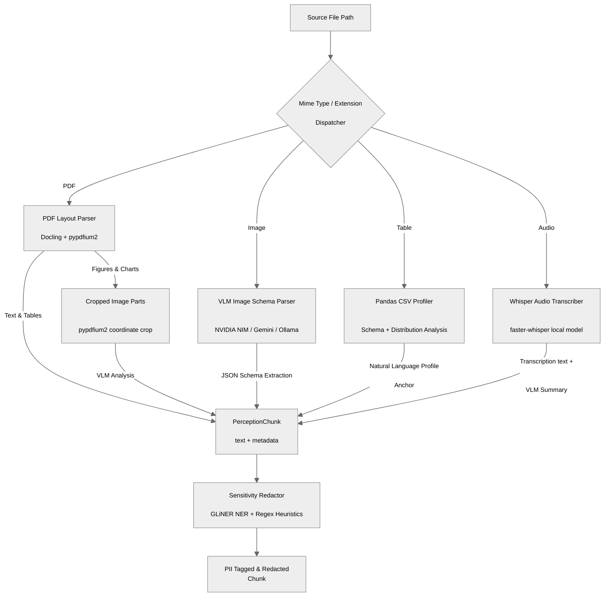
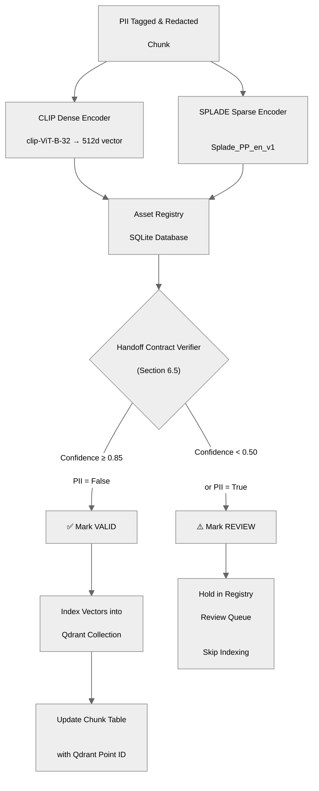

## Figure 6.1

```mermaid

%%{init: {"theme": "neutral", "themeVariables": {"fontFamily": "Arial, Helvetica, sans-serif", "fontSize": "11px", "actorFontSize": "11px", "noteFontSize": "10px", "messageFontSize": "10px"}}}%%
flowchart TD
    SRC["Source File Path"] --> DISPATCH{"Mime Type / Extension

Dispatcher"}

DISPATCH -->|"PDF"| PDF_P["PDF Layout Parser

Docling + pypdfium2"]
DISPATCH -->|"Image"| VLM_P["VLM Image Schema Parser


NVIDIA NIM / Gemini / Ollama"]
DISPATCH -->|"Table"| CSV_P["Pandas CSV Profiler


Schema + Distribution Analysis"]
DISPATCH -->|"Audio"| AUDIO_P["Whisper Audio Transcriber


faster-whisper local model"]

PDF_P -->|"Text & Tables"| CHUNK["PerceptionChunk

text + metadata"]
PDF_P -->|"Figures & Charts"| CROP["Cropped Image Parts


pypdfium2 coordinate crop"]
CROP -->|"VLM Analysis"| CHUNK

VLM_P -->|"JSON Schema Extraction"| CHUNK
CSV_P -->|"Natural Language Profile

Anchor"| CHUNK
AUDIO_P -->|"Transcription text +


VLM Summary"| CHUNK

CHUNK --> REDACT["Sensitivity Redactor

GLiNER NER + Regex Heuristics"]
REDACT --> OUT["PII Tagged & Redacted
Chunk"]
```

## Figure 6.2

```mermaid
%%{init: {"theme": "neutral", "themeVariables": {"fontFamily": "Arial, Helvetica, sans-serif", "fontSize": "11px", "actorFontSize": "11px", "noteFontSize": "10px", "messageFontSize": "10px"}}}%%

flowchart TD
    CHUNK["PII Tagged & Redacted

Chunk"]

CHUNK --> CLIP["CLIP Dense Encoder

clip-ViT-B-32 → 512d vector"]
CHUNK --> SPLADE["SPLADE Sparse Encoder


Splade_PP_en_v1"]

CLIP --> REG["Asset Registry

SQLite Database"]
SPLADE --> REG

REG --> VERIFY{"Handoff Contract Verifier

(Section 6.5)"}

VERIFY -->|"Confidence ≥ 0.85

PII = False"| VALID["✅ Mark VALID"]
VERIFY -->|"Confidence < 0.50


or PII = True"| REVIEW["⚠️ Mark REVIEW"]

VALID --> INDEX["Index Vectors into

Qdrant Collection"]
INDEX --> UPDATE["Update Chunk Table


with Qdrant Point ID"]

REVIEW --> HOLD["Hold in Registry

Review Queue


Skip Indexing"]

```
