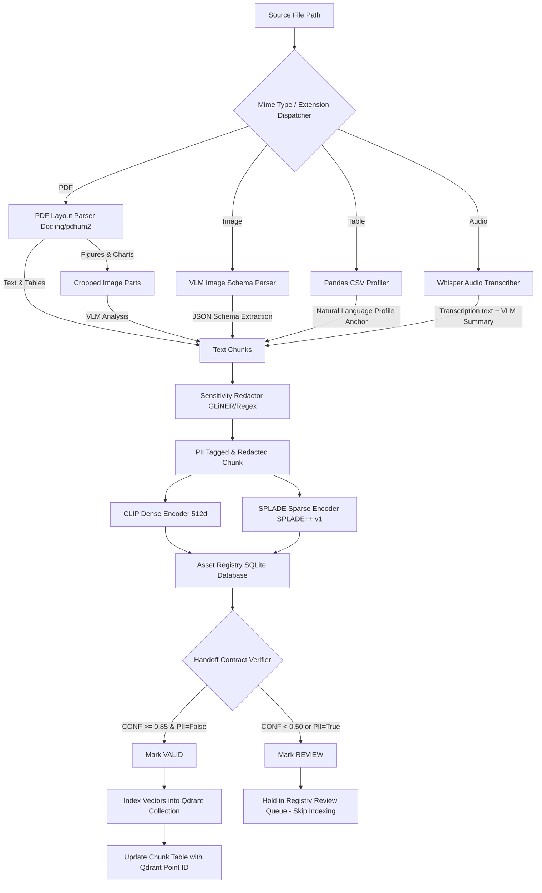
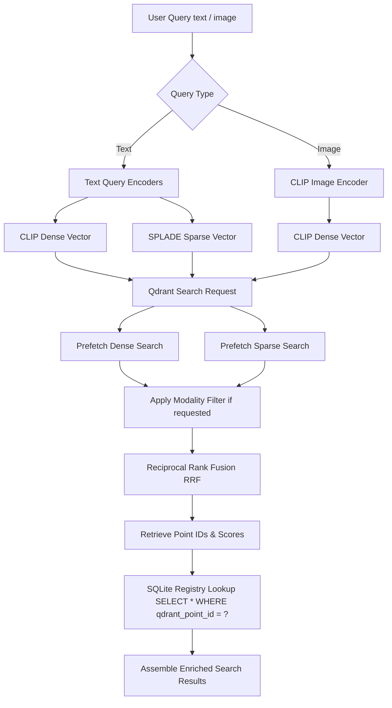
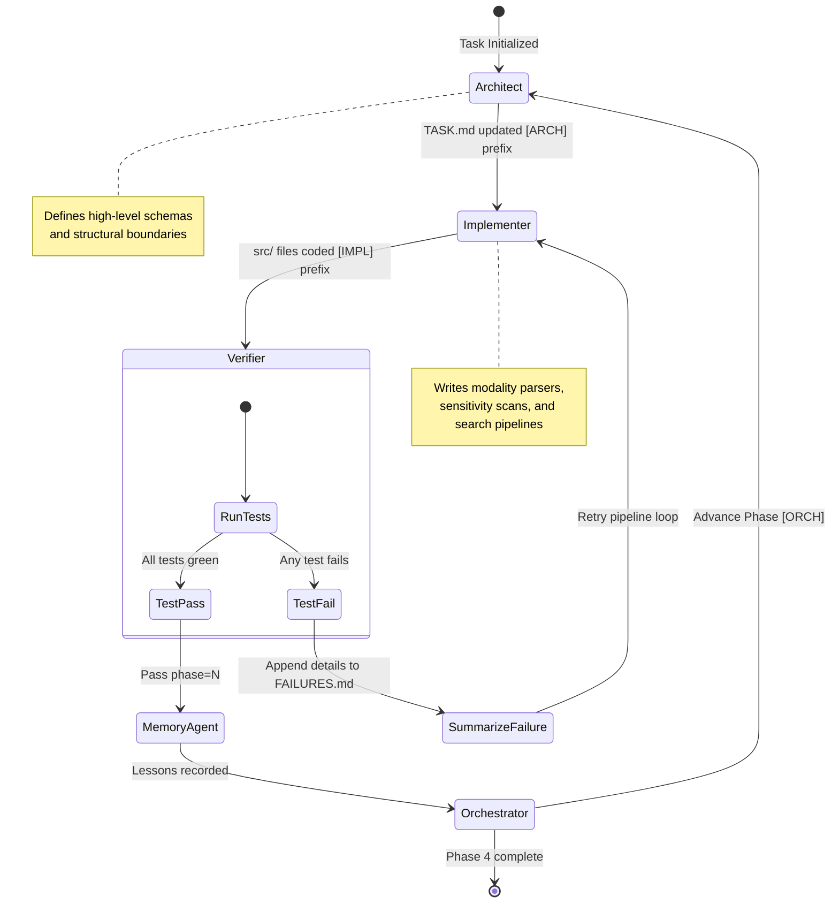

# Multimodal Perception Ingestion & Retrieval Workflows

This document details the operational workflows of the multimodal perception layer using Mermaid diagrams and pipeline specifications.

---

## 1. End-to-End Ingestion Pipeline Workflow

This workflow represents the ingestion of documents of various modalities (PDF, PNG, CSV, WAV) through the perception extractors, embeddings, PII scanners, handoff verifiers, SQLite registries, and the Qdrant vector database.

---

## 2. Cross-Modal Search & Retrieval Workflow

This workflow displays the hybrid search retrieval, combining CLIP dense, SPLADE sparse, Reciprocal Rank Fusion (RRF), and SQL metadata joins to yield enriched assets.

---

## 3. Gated Agentic Loop State Transitions

This state diagram depicts the execution contracts and phase gates governing autonomous iteration within the repository.

