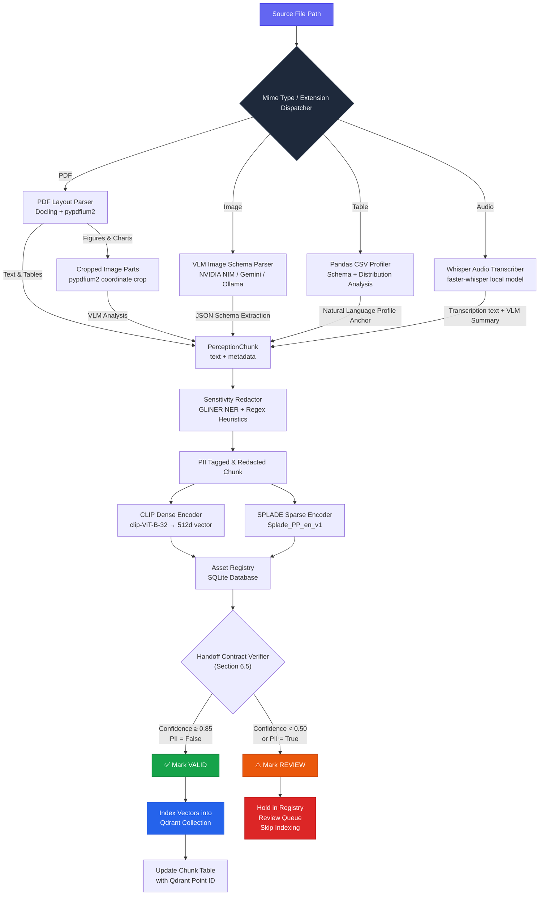
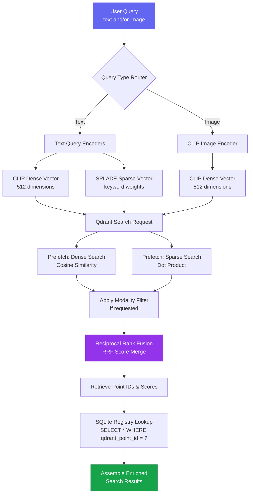
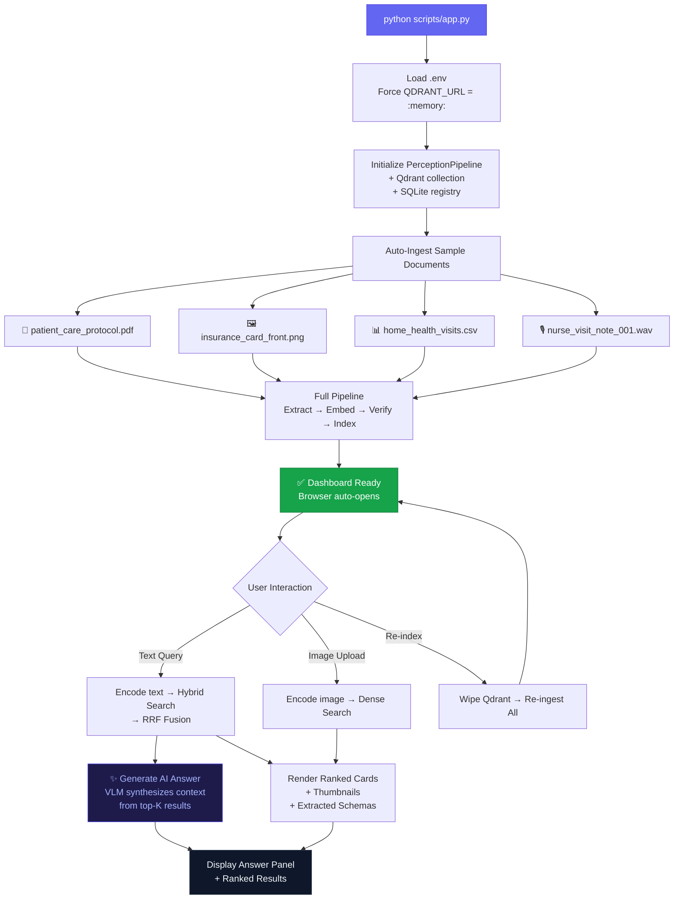
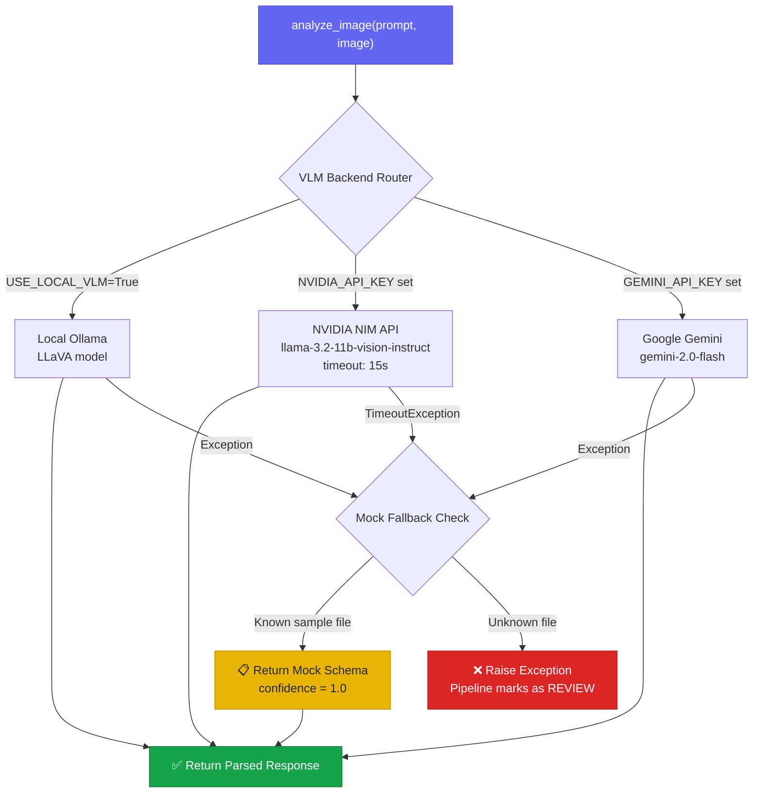

# Multimodal Perception Ingestion & Retrieval Workflows

This document details the operational workflows of the multimodal perception layer using Mermaid diagrams and pipeline specifications. Each diagram maps to specific Chapter 6 sections and can be rendered in any Mermaid-compatible viewer (GitHub, VS Code, Obsidian, etc.).

---

## 1. End-to-End Ingestion Pipeline Workflow

> **Chapter Reference:** Sections 6.1, 6.3, 6.4, 6.5

This workflow represents the ingestion of documents of various modalities (PDF, PNG, CSV, WAV) through the perception extractors, embeddings, PII scanners, handoff verifiers, SQLite registries, and the Qdrant vector database.



### Key Design Decisions

| Decision | Rationale |
|---|---|
| **Layout-guided PDF extraction** | Docling identifies text vs. figure zones structurally, avoiding blind OCR on charts |
| **VLM timeout = 15 seconds** | Prevents pipeline hangs when cloud APIs are slow; triggers mock fallback for sample files |
| **PII scan before embedding** | Ensures sensitive data never enters the vector index |
| **Confidence-gated indexing** | Low-confidence chunks go to human review queue, not Qdrant |

---

## 2. Cross-Modal Search & Retrieval Workflow

> **Chapter Reference:** Section 6.4

This workflow displays the hybrid search retrieval, combining CLIP dense, SPLADE sparse, Reciprocal Rank Fusion (RRF), and SQL metadata joins to yield enriched assets.



### Hybrid Search Details

| Component | Model | Dimensionality | Similarity Metric |
|---|---|---|---|
| Dense encoder | `clip-ViT-B-32` | 512 | Cosine |
| Sparse encoder | `Splade_PP_en_v1` | Variable | Dot Product |
| Fusion | Reciprocal Rank Fusion | N/A | Score merge |

---

## 3. Gradio Explorer UI Workflow

> **Chapter Reference:** Section 6.5 (Interactive Demonstration)

This workflow shows how the Gradio web application orchestrates the full pipeline lifecycle — from startup auto-ingestion through interactive query, RAG answer synthesis, and result rendering.



---

## 4. VLM Client Failover Strategy

> **Chapter Reference:** Section 6.3

This diagram shows how the VLM client routes requests through multiple backends with timeout handling and mock fallbacks.



### Timeout & Retry Policy

| Parameter | Value | Rationale |
|---|---|---|
| HTTP timeout | 15 seconds | Prevents pipeline hangs on slow cloud endpoints |
| Retry on timeout | **No** | `TimeoutException` fails immediately (no backoff loop) |
| Retry on HTTP 429 | **Yes** | Up to 3 attempts with exponential backoff (2s → 4s → 8s) |
| Mock fallback | Sample files only | Insurance card and nurse note return pre-configured schemas |

---
## Sec 6.1 image

```
graph TD
    subgraph P1[" "]
    direction LR
    A["Source File"] --> B{"Format<br/>Dispatcher"}
    B -->|PDF/Image/Table/Audio| C["Format Parsers<br/>Docling · VLM · Pandas · Whisper"]
    C --> D["PerceptionChunk<br/>(text + metadata)"]
    D --> E["PII Redactor<br/>GLiNER + Regex"]
    E --> F["Tagged Chunk"]
    end

    subgraph P2[" "]
    direction LR
    G["Dual Encoders<br/>CLIP + SPLADE"] --> H["Asset Registry<br/>(SQLite)"]
    H --> I{"Contract<br/>Verifier"}
    I -->|Conf ≥0.85, PII=False| J1["✅ VALID"]
    I -->|Conf <0.50 or PII=True| J2["⚠️ REVIEW"]
    J1 --> K["Index in Qdrant<br/>+ Update Chunk Table"]
    J2 --> M["Review Queue<br/>(Skip Indexing)"]
    end

    P1 --> P2

    style A fill:#6366f1,color:#fff,stroke:#4f46e5
    style B fill:#1e293b,color:#f1f5f9,stroke:#334155
    style J1 fill:#16a34a,color:#fff,stroke:#15803d
    style J2 fill:#ea580c,color:#fff,stroke:#c2410c
    style K fill:#2563eb,color:#fff,stroke:#1d4ed8
    style M fill:#dc2626,color:#fff,stroke:#b91c1c
    style P1 fill:transparent,stroke:transparent
    style P2 fill:transparent,stroke:transparent

```
